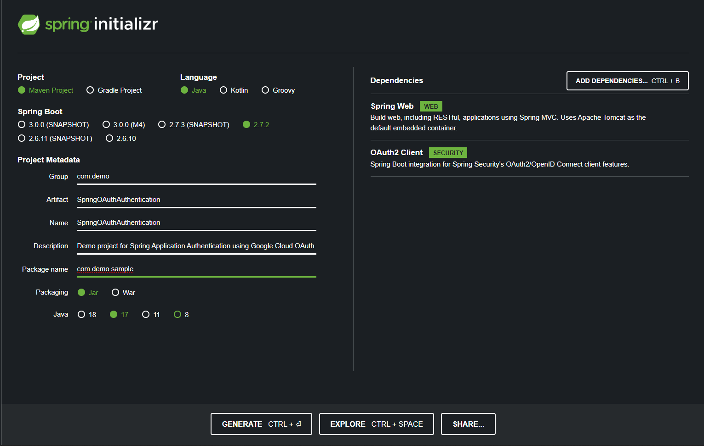
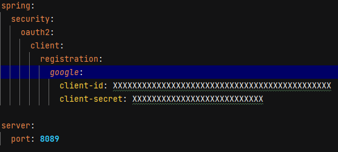

# SpringCloudAuthentication
Demo Project for Spring Cloud Authentication

# Spring Cloud Security | OAuth2 Google Sign In  

 Create a Spring Boot Project using STS or Intellij IDEA or Eclipse or visit 
[Spring Initializer](https://start.spring.io) and create a project

### Project Configuration:
    
* **Project Type**: Maven  
* **Language**: Java  

###### Project Metadata

* Enter Group Name
* Enter Artifact details
* Enter Name
* Enter Description
* choose packaging name
* Packaging : JAR
* Java version : choose According to your installed version

###### Dependencies Required

* Spring Web 
* OAuth-2 Client

### Required Software

* Code Editor (Intellij IDEA, STS , Eclipse etc..)
* Java 

Generate the project and extract the downloaded project and open with any code editor

###### Generating OAuth2 Client Id and Secret 

* visit [Google Console](https://console.cloud.google.com)  and Sign in
* Click on Navigation Menu Icon. Click on APIs & Services and Choose Credentials Option
* Click on Create Credentials -> OAuth Client ID
* Choose Application Type : Web Application
* Enter Application name
* Add URI for Authorized JavaScript origins. when we hit this uri it will open google login page. eg: My application Launching on 8089 port so URI: [Localhost Page](http://localhost:8089)
* Add Authorization URI Details. [http://localhost:8089/login/oauth2/code/google](http://localhost:8089/login/oauth2/code/google)
* Click on create copy the client id and secret

###### Update Application.properties or Application.yaml file

If we use yaml config: file will be   

Replace client id and secret copied from Google console.

* We need to create ApplicationSecurityConfig file where we need to configure the application to handle the requests comes to Application
* Create Your Rest Service and start the application.
* Here I'm created WelcomeController to display the request after authentication

### Guides

The following guides illustrate how to use some features concretely:

* [Building a RESTful Web Service](https://spring.io/guides/gs/rest-service/)
* [Building REST services with Spring](https://spring.io/guides/tutorials/rest/)

